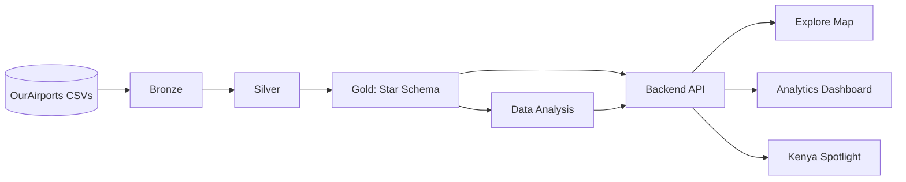

# AeroAtlas

Turns the [OurAirports](https://ourairports.com/data/) open dataset into a queryable, analyzed, and visually explorable atlas of the world's aviation infrastructure — with JKIA and Kenya's airport network as the flagship spotlight, benchmarked against East Africa and global peers.

[Project Phases & Status](#project-phases--status).

---

## Table of Contents
- [Overview](#overview)
- [Architecture](#architecture)
- [Tech Stack](#tech-stack)
- [Repository Structure](#repository-structure)
- [Business Questions This Project Answers](#business-questions-this-project-answers)
- [Getting Started](#getting-started)
- [Data Source & Attribution](#data-source--attribution)
- [Future Work](#future-work)
- [License](#license)
- [Author](#author)

---

## Overview

AeroAtlas is a full-stack data project built on a single, coherent dataset: seven linked OurAirports tables covering airports, runways, navaids, radio frequencies, countries, regions, and community comments. </br>
Every layer of the stack — data engineering, data science, data analysis, backend, and frontend — reads from and builds on the same underlying schema, so the whole thing is one glued-together pipeline rather than five disconnected exercises.


## Architecture




## Tech Stack

| Layer | Stack |
|---|---|
| Data Engineering | Python, pandas, DuckDB (dev/transform), PostgreSQL (production-serving), dbt Core |
| Data Analysis | Jupyter, DuckDB/SQL, pandas, matplotlib/seaborn or Plotly |
| Backend | FastAPI, SQLAlchemy, Pydantic, pytest + httpx |
| Frontend | Jinja2 templates, hand-written CSS/JS, Leaflet.js (+ Leaflet.markercluster), Chart.js |
| Infrastructure | Docker & Docker Compose, GitHub Actions (CI), pre-commit (ruff, black, mypy) |

## Repository Structure

```
aeroatlas/
├── data/raw/          # gitignored -- the 7 OurAirports CSVs
├── ingestion/         # Bronze layer scripts
├── transforms/        # Silver/Gold -- dbt project
├── ml/                # Data Science layer (open)
├── analysis/          # Data Analysis -- notebooks + saved queries
├── api/               # FastAPI backend
├── web/               # Frontend -- templates + static assets
├── tests/             # mirrors the layers above
├── scripts/           # one-off dev/ops scripts
├── docs/              # architecture docs, ADRs, roadmaps
├── .env.example
├── docker-compose.yml
├── Dockerfile
├── pyproject.toml
├── README.md          # this file
└── LICENSE
```


## Business Questions This Project Answers

1. Which airports can handle narrow-body vs only light aircraft, by
   runway length?
2. Which regions/countries have the weakest navaid coverage?
3. Which airports lack a published tower/ATIS frequency?
4. How does Kenya's airport network compare to Tanzania, Uganda, Ethiopia,
   and global peers?
5. How has community engagement (comment activity) around airports
   changed over time?

Answered in `analysis/02_core_questions.ipynb` and
`analysis/03_supplementary.ipynb`, exposed as `/analytics/*` endpoints in
the API, and rendered on the dashboard and Kenya spotlight pages.

## Getting Started

### Prerequisites
- Python 3.11+
- Docker & Docker Compose
- Git

### 1. Clone & configure
```bash
git clone https://github.com/john-otienoh/ourairports_data_project/
cd ourairports_data_project
cp .env.example .env   # fill in your own values
```

### 2. Set up the environment
```bash
python -m venv .venv
source .venv/bin/activate
pip install -e ".[dev]"
pre-commit install
```

### 3. Bring up infrastructure
```bash
docker compose up -d
```
Brings up Postgres with empty `bronze`/`silver`/`gold` schemas.

### 4. Run the data pipeline
```bash
dbt run
dbt test
```
Builds Bronze → Silver → Gold and runs the full data quality suite.

### 5. Run the API
```bash
uvicorn api.main:app --reload
```
- Interactive API docs: http://localhost:8000/docs
- Health check: http://localhost:8000/health

### 6. Explore the app
- Map: http://localhost:8000/explore
- Dashboard: http://localhost:8000/dashboard
- Kenya spotlight: http://localhost:8000/kenya

## Data Source & Attribution

All airport, runway, navaid, frequency, country, region, and comment data
comes from [OurAirports](https://ourairports.com/data/), a
community-maintained dataset covering 80,000+ airports worldwide.
OurAirports releases its data into the public domain — no permission or
attribution is legally required, though it's appreciated. Full
column-level documentation is in `docs/data_dictionary.md`, adapted from
OurAirports' own data dictionary.

## Future Work

- **Data Science (Phase 2)** — an NLP sentiment/keyword model over
  `airport_comments`, and a classifier predicting `scheduled_service`.
  Both already have a stable placeholder contract in the Backend API
  (`/airports/{ident}/sentiment`, `/airports/{ident}/service-prediction`)
  and a pending-state block on the Frontend, so wiring in real
  predictions won't require touching anything else already built.
- **Deployment** — cloud hosting, a domain, and TLS were intentionally
  left out of every phase so far.
- **Optional stretch ideas** noted throughout the roadmaps: Airflow/Dagster
  orchestration, an unpivoted `fact_runway_end` table, Playwright E2E
  tests, basic API rate limiting.

## License

MIT — see [`LICENSE`](LICENSE). The AeroAtlas code is MIT-licensed; the
underlying OurAirports data is public domain (see
[Data Source & Attribution](#data-source--attribution) above).

## Author

**John Charles Otieno** ([@john-otienoh](https://github.com/john-otienoh))